# Secure firmware OTA using AWS IoT via Ethernet featuring Dual Bank Flash and Secure Boot  

**This code example uses a TRAVEO™ T2G MCU to run the OTA function of the AWS IoT Cloud via Ethernet using MQTT over TLS. It also adopts Dual Bank Flash to enable fast activation/roll-back between old and new firmware, Secure Boot feature to ensure the security of the firmware and Crypto hardware which accelerates the crypto operation.**  

## Device

The device used in this code example (CE) is:

- [TRAVEO™ T2G CYT4BF Series](https://www.infineon.com/cms/en/product/microcontroller/32-bit-traveo-t2g-arm-cortex-microcontroller/32-bit-traveo-t2g-arm-cortex-for-body/traveo-t2g-cyt4bf-series/)

## Board

The board used for testing is:

- TRAVEO™ T2G evaluation kit ([KIT_T2G-B-H_LITE](https://www.infineon.com/cms/en/product/evaluation-boards/kit_t2g-b-h_lite/))

## Scope of work
This implementation demonstrates secure and high-speed firmware OTA (FOTA) using AWS IoT cloud:
 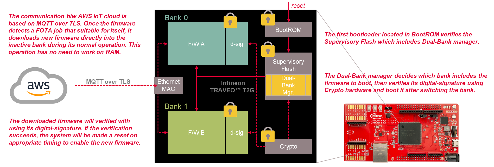 

## Introduction  
The features of the T2G MCU are fully utilized:
 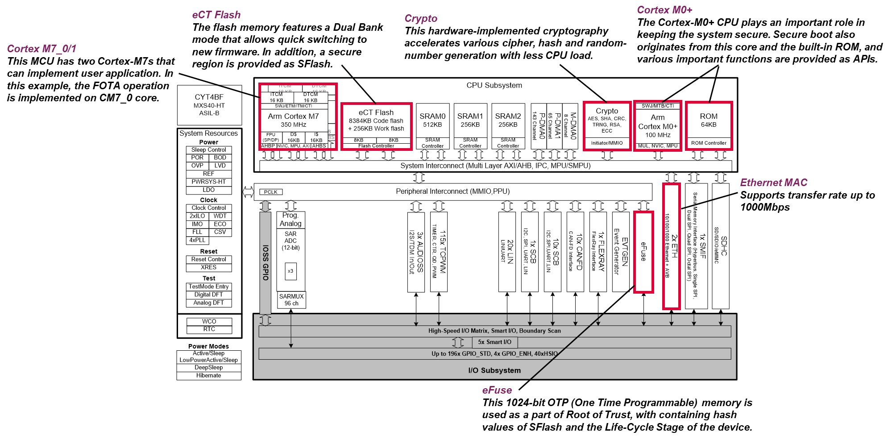 

More details can be found in [Technical Reference Manual (TRM)](https://www.infineon.com/dgdl/?fileId=5546d4627600a6bc017600bfae720007), [Registers TRM](https://www.infineon.com/dgdl/?fileId=5546d4627600a6bc017600be2aef0004) and [Data Sheet](https://www.infineon.com/dgdl/?fileId=5546d46275b79adb0175dc8387f93228).

## Hardware setup

This CE has been developed for:
- TRAVEO™ T2G Body High Lite evaluation kit ([KIT_T2G-B-H_LITE](https://www.infineon.com/cms/en/product/evaluation-boards/kit_t2g-b-h_lite/)) 
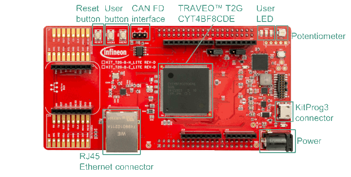 
No changes are required from the board's default settings.
    - Connect the kit with the internet using RJ45 Ethernet connector
    - The user button 1 (USER1) works as a force boot-up with bank-0

## Implementation

**Firmware OTA with secure-boot on use of Dual Bank flash**  
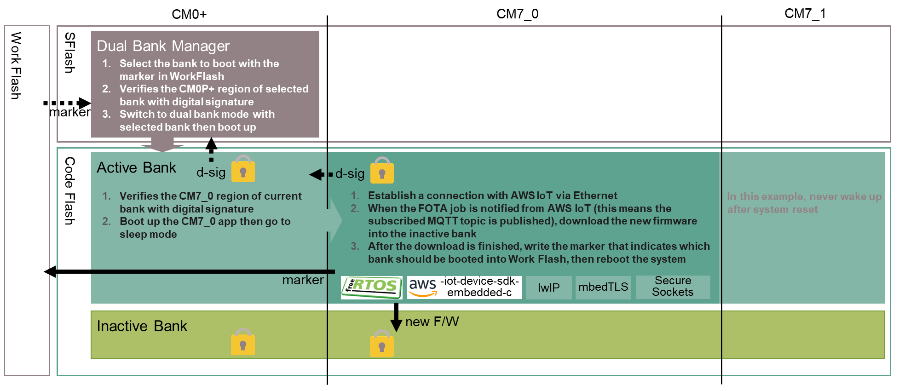

- This implementation adopts the secure-boot architecture. It guarantees the reliability of the firmware based on the security concept of T2G MCU. The Dual Bank Manager located in SFlash is immutable after the MCU goes to SECURE life-cycle stage, and its authenticity is verified by ROM Boot code using secure hash stored in eFuse. Then the Dual Bank Manager decides which bank should be booted by referring a marker stored in Work Flash, then verifies selected side with its digital signature and the public key stored in SFlash. For more details about this concept, [AN229058](https://www.infineon.com/dgdl/?fileId=8ac78c8c7cdc391c017d0d3e8f7c67e6) has informative descriptions.
- After the Dual Bank Manager activates either bank, the CM0+ core starts working on Code Flash. Here it verifies the region for application of CM7_0 core using its digital signature and boot it up if the verification succeeds. If you would like to focus on the secure boot concept, another code example [SECURE boot](https://github.com/Infineon/mtb-t2g-example-secure-boot) is also available. As a side note, the implementation regarding the requisition for the secure boot (to prepare asymmetric key set and have public key in the firmware, etc.) is same with that example.
- The main application is implemented to work on CM7_0 core which contains firmware OTA functionality. The software consists of [freeRTOS](https://github.com/Infineon/freertos), [aws-iot-device-sdk-embedded-c](https://github.com/aws/aws-iot-device-sdk-embedded-C), [lwIP](https://git.savannah.nongnu.org/git/lwip), [mbedTLS](https://github.com/ARMmbed/mbedtls), [secure-sockets](https://github.com/Infineon/secure-sockets), [Peripheral driver library (PDL)](https://infineon.github.io/mtb-pdl-cat1/pdl_api_reference_manual/html/index.html) and so on.

**Register the kit as a thing managed by AWS IoT**  

- Before proceed this step, it's better to prepare the AWS IoT cloud environment, the steps are described in later section (**Setting up AWS IoT**). To register the kit as a thing, several output files created on these steps are required. All the setting regarding the kit should be prepared in the file *proj_cm7_0/configs/credentials_config.h*
    - A thing name given to your kit should be set as definition named *CLIENT_IDENTIFIER* included in *proj_cm7_0/configs/credentials_config.h*.
       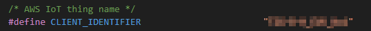
    - The root CA 1 (RSA 2K) certificate must be set as the string *aws_root_ca_certificate[]* included in *proj_cm7_0/configs/credentials_config.h*.
       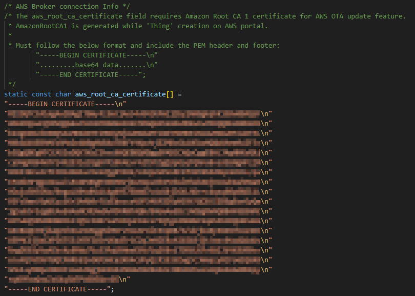
    - The client certificate and its private key should be set as string named *aws_client_cert[]* and *aws_client_key[]* respectively, included in *proj_cm7_0/configs/credentials_config.h*.
       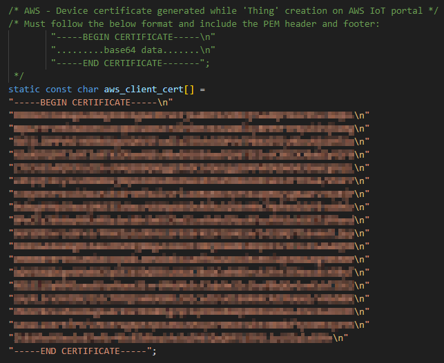
       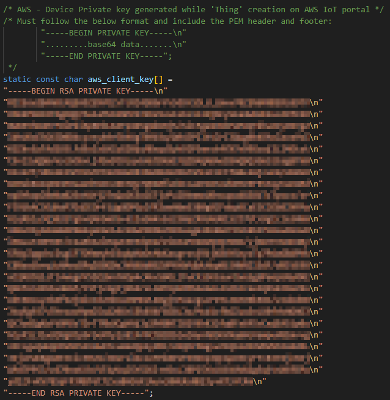

**Get connected with AWS IoT**  

- The first thing to do is setting up the method to acquire the IP address. There are two options, dynamically allocate it using DHCP or static assignment. It can be selected by the definition *ENABLE_STATIC_IP_ADDRESS* in the file *proj_cm7_0/aws_ota_mqtt.c*.
   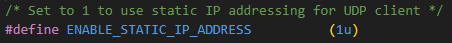
    -  To specify the static address, set it to non-zero value and give addresses to the definition *STATIC_IP_ADDR*, *STATIC_GATEWAY*, *NETMASK* and *DNS_SERVER* respectively.
       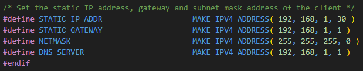
    -  To use DHCP, set its value to zero.
- Next, the device endpoint URL should be set as definition *AWS_IOT_ENDPOINT* prepared in the file *proj_cm7_0/configs/credentials_config.h*.
   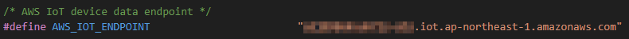
   The way to confirm it can be referred in [AWS website](https://docs.aws.amazon.com/iot/latest/developerguide/iot-connect-service.html).
- The connection will be automatically established after the application startup if there is no problem with the configurations written above.

**Receive job notification from AWS IoT**  

- After the kit gets connected with AWS IoT, it subscribes MQTT topic which indicates the job for the kit has activated. Refer the steps to the section **Preparing the OTA job in AWS IoT**.

**Download new firmware**  

- Before download the new firmware, the current firmware should have the code signing certificate which is created in the section **Registering the kit with AWS IoT as a thing** as a definition *AWS_IOT_OTA_SIGNING_CERT* prepared in the file *proj_cm7_0/configs/ota_config.h*.
   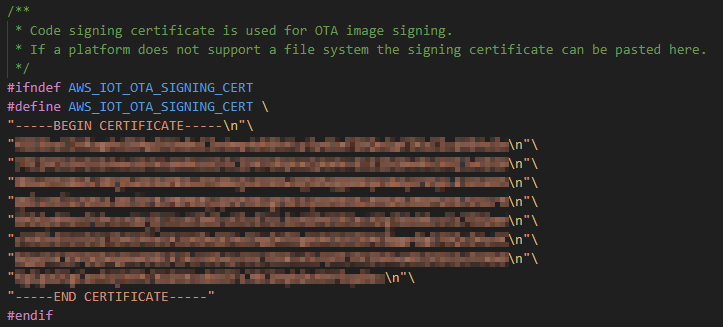
- After the download of whole new firmware is finished, the current firmware verifies digital signature added to the new firmware with its possessing code signing certificate. It should successfully be verified if there is no alteration on the new firmware. Then the firmware writes a flash marker on the Work Flash to indicate that the latest firmware is on the current inactive bank, then performs software reset to activate the downloaded new firmware.

**Boot up with new firmware**  

- After the software reset, the Dual Bank Manager software will start as a first user code. It will firstly check the flash marker on the Work Flash to decide which side of bank has the latest firmware. Then it verifies the digital signature of selected side using public key prepared in SFlash. If the verification succeeds, switches the bank to verified side then jump to the firmware on Code Flash. This implementation is well described in [AN229058](https://www.infineon.com/dgdl/?fileId=8ac78c8c7cdc391c017d0d3e8f7c67e6).

- Sometimes you may want to force boot up the firmware of written in bank-0, especially to debug the firmware. For that case, the Dual Bank Manager of this implementation detects push of the user button to forcibly select the firmware on the bank-0 regardless of the marker value.

## Run and Test

**Setting up AWS IoT**  
First, AWS IoT environment which distributes a new firmware should be prepared. Amazon provides how to prepare the OTA update environment in [AWS website](https://docs.aws.amazon.com/freertos/latest/userguide/ota-prereqs.html).

- **Create AWS account**
 Follow the steps described in [AWS website](https://repost.aws/knowledge-center/create-and-activate-aws-account) if you still don't have the account. Then get logged in to [AWS Management Console](https://aws.amazon.com/console).

- **Create IAM user**
 Follow the steps described in [AWS website](https://docs.aws.amazon.com/IAM/latest/UserGuide/getting-set-up.html#create-an-admin) to create an administrative user if you don't create it yet.

- **Registering the kit with AWS IoT as a thing**
 Follow the steps described in [AWS website](https://docs.aws.amazon.com/freertos/latest/userguide/freertos-prereqs.html#get-started-freertos-thing). Note that the step requires an access to AWS via AWS CLI, so the AWS CLI should be installed and be configured before using it. You can refer the way of the [installation](https://docs.aws.amazon.com/cli/latest/userguide/getting-started-install.html) and [configuration](https://docs.aws.amazon.com/cli/latest/userguide/getting-started-quickstart.html).

    - The AWS IoT policy attached to the thing used in our evaluation is like below:
       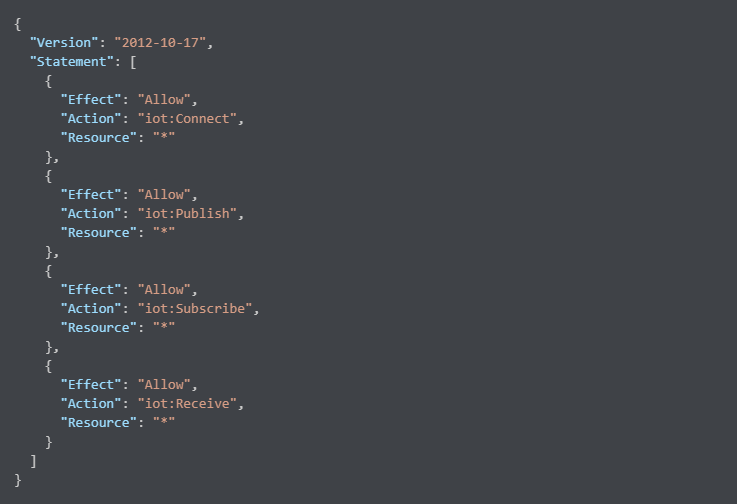 
      The file that has same content with above is included in project subfolder *resources* as *device_policy.json*.

    - If a new thing that represents your kit is created, the key files and device certificate will be output. The key files can only be downloaded at the time, so make sure to keep them on the local storage. In addition, all the files will be used in the later steps so they are recommended to download as well. 

- **Create a S3 bucket to store new firmware binary**
 Follow the steps described in [AWS website](https://docs.aws.amazon.com/freertos/latest/userguide/dg-ota-bucket.html). The S3 bucket will be used as a data store of new firmware to be distributed.

- **Create an OTA update service role**
 Follow the steps described in [AWS website](https://docs.aws.amazon.com/freertos/latest/userguide/create-service-role.html). The created role will be used in the step of creating OTA job.

- **Create OTA user policy and bind it to the IAM user**
 Follow the steps described in [AWS website](https://docs.aws.amazon.com/freertos/latest/userguide/create-ota-user-policy.html). 
    - The user policy created and used in our evaluation is like below, where xxxxxxx is S3 bucket name, yyyyyyyyyyyy is your Account ID and zzzz is OTA update service role name:
       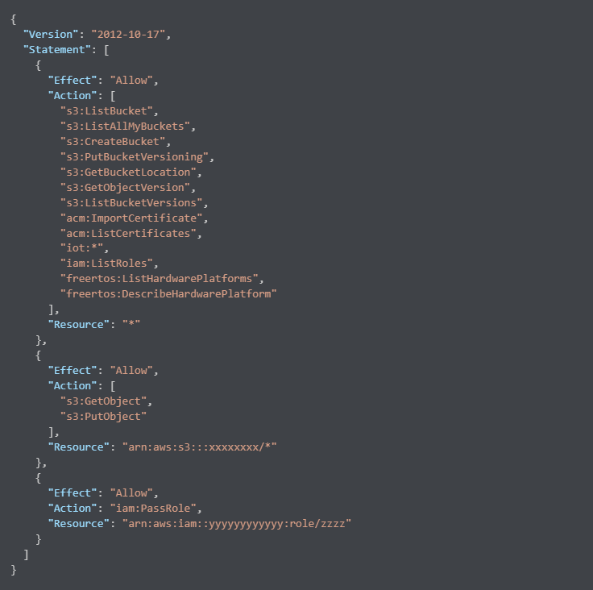 
    The file that has same content with above is included in project subfolder *resources* as *user_policy.json*.

- **Create a code-signing certificate**
    - The steps for various platforms are described in [AWS website](https://docs.aws.amazon.com/freertos/latest/userguide/ota-code-sign-cert.html). This example uses an ECDSA P-256 key and SHA-256 hash, so the steps to create it is same as described in [AWS website](https://docs.aws.amazon.com/freertos/latest/userguide/ota-code-sign-cert-win.html). Then the created certificate should be pasted in the file *proj_cm7_0/configs/ota_config.h* like below:
        
    Note that the step requires an access to AWS via AWS CLI, so the AWS CLI should be installed and an AWS Access Key ID and an AWS Secret Access Key should be made and set correctly to the AWS CLI environment. The way to do it is written in [AWS website](https://docs.aws.amazon.com/IAM/latest/UserGuide/id_credentials_access-keys.html#Using_CreateAccessKey).

**Preparing the OTA job in AWS IoT**  

- **Create and register new firmware binary to be distributed**
    - On the creation of new firmware, its versioning should be taken care. This OTA implementation checks whether the version of new firmware is newer than the one of the current firmware. The version can define in the file *common/appversion.h*:
       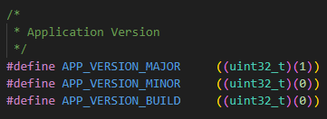 
    - After defining the version, build the project and create its binary image. A script named *mkbin.pl* is prepared to do that in the folder *utils*. To execute the script, type `perl mkbin.pl` on the `Terminal` tab of the project (or modus-shell). Once the script has executed, the binary file which only contains CM0+/CM7_0/CM7_1 application except for Dual Bank Manager part will be made as *app_combined_s.bin* in the folder *build*. The file can be renamed like *v2.0.0.bin* as you like.
    - The created binary file of new firmware should be stored in S3 bucket created in the section **Create a S3 bucket to store new firmware binary**.
  
- **Create and run the job**
    - Finally, the OTA job can be made by referring [AWS website](https://docs.aws.amazon.com/freertos/latest/userguide/ota-console-workflow.html).
        - Make sure to select the kit to be reprogrammed in *Devices to update*.
        - Select `MQTT` for *Select the protocol for file transfer*.
        - For the first time to create the job, the *Code signing profile* should newly be created by selecting the code signing certificate that created in the section **Create a code-signing certificate**. From the second time, the code signing profile that created on the first time can be reused.
        - The *Pathname of file on device* has no meaning at this implementation, but the console requires something effective string, so it is ok with just fill like `test`.
        - The *File type* should set as `141`, because this implementation checks its value contained in distributed job document.
        - The *IAM role* should select the one that created in the section **Create an OTA update service role**.

**Setting up the terminal emulator**  

For this CE, a terminal emulator is required for displaying outputs and get inputs. Install a terminal emulator if you do not have one. Instructions in this document use [Tera Term](https://ttssh2.osdn.jp/index.html.en).

**OTA update execution**  

After code compilation, perform the following steps to flashing the device:

1. Connect the board to your PC using the provided USB cable through the KitProg3 USB connector.
2. Open a terminal program and select the KitProg3 COM port. Set the serial port parameters to 8N1 and 115200 baud.
3. Program the board using one of the following:
    - Select the CE project in the Project Explorer.
    - In the **Quick Panel**, scroll down, and click **[Project Name] Program (KitProg3_MiniProg4)**.
4. After programming, the CE starts automatically. Confirm that the messages are displayed on the UART terminal.

    - *Terminal output on program startup* 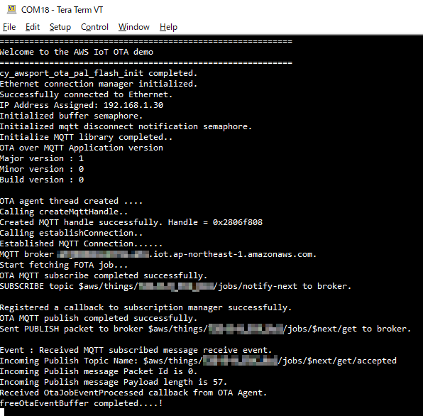
5. If you have not yet activated your OTA job, refer the section **Preparing the OTA job in AWS IoT** to create and activate it.
6. You can debug the example to step through the code. In the IDE, use the **[Project Name] Debug (KitProg3_MiniProg4)** configuration in the **Quick Panel**. For details, see the "Program and debug" section in the [Eclipse IDE for ModusToolbox™ software user guide](https://www.infineon.com/dgdl/?fileId=8ac78c8c8386267f0183a8d7043b58ee). Note that if you are going to debug the Dual Bank Manager code, it should be located on a small sector of Code Flash instead of SFlash. To do that, an additional linker option should be added in *proj_cm0p/Makefile*:
   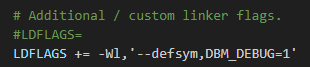 
Note that the debug session will work with the firmware written in the bank-0 of Code Flash, but the Dual Bank Manager will decide the firmware to boot up depend on the marker value on the Work Flash. Refer the section **Boot up with new firmware** to avoid the debug session using bank-1.  
**Note:** **(Only while debugging)** On the CM7 CPU, some code in *main()* may execute before the debugger halts at the beginning of *main()*. This means that some code executes twice: once before the debugger stops execution, and again after the debugger resets the program counter to the beginning of *main()*. See [KBA231071](https://community.infineon.com/t5/Knowledge-Base-Articles/PSoC-6-MCU-Code-in-main-executes-before-the-debugger-halts-at-the-first-line-of/ta-p/253856) to learn about this and for the workaround.

## References  

Relevant Application notes are:

- AN235305 - GETTING STARTED WITH TRAVEO™ T2G FAMILY MCUS IN MODUSTOOLBOX™
- [AN220242](https://www.infineon.com/dgdl/?fileId=8ac78c8c7cdc391c017d0d3b05c26796) - Flash accessing procedure for TRAVEO™ T2G family
- [AN229058](https://www.infineon.com/dgdl/?fileId=8ac78c8c7cdc391c017d0d3e8f7c67e6) - Secured firmware over-the-air (FOTA) update in TRAVEO™ T2G MCU

ModusToolbox™ is available online:
- <https://www.infineon.com/modustoolbox>

Associated TRAVEO™ T2G MCUs can be found on:
- <https://www.infineon.com/cms/en/product/microcontroller/32-bit-traveo-t2g-arm-cortex-microcontroller/>

More code examples can be found on the GIT repository:
- [TRAVEO™ T2G Code examples](https://github.com/orgs/Infineon/repositories?q=mtb-t2g-&type=all&language=&sort=)

For additional trainings, visit our webpage:  
- [TRAVEO™ T2G trainings](https://www.infineon.com/cms/en/product/microcontroller/32-bit-traveo-t2g-arm-cortex-microcontroller/32-bit-traveo-t2g-arm-cortex-for-body/traveo-t2g-cyt4bf-series/#!trainings)

For questions and support, use the TRAVEO™ T2G Forum:  
- <https://community.infineon.com/t5/TRAVEO-T2G/bd-p/TraveoII>  
